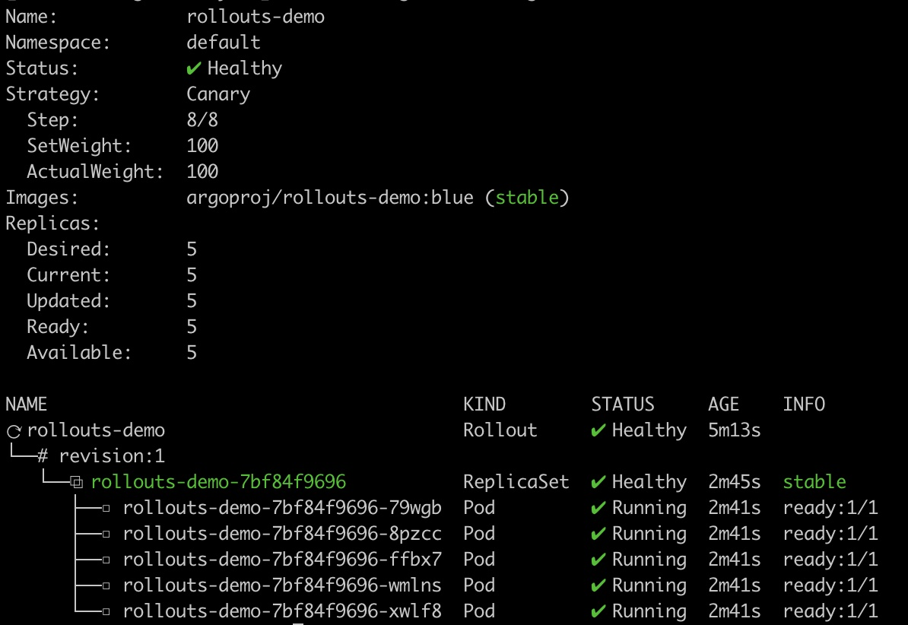
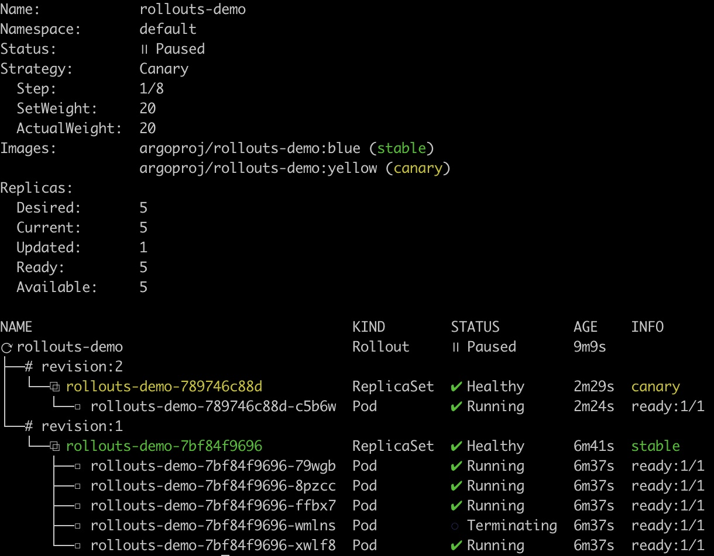
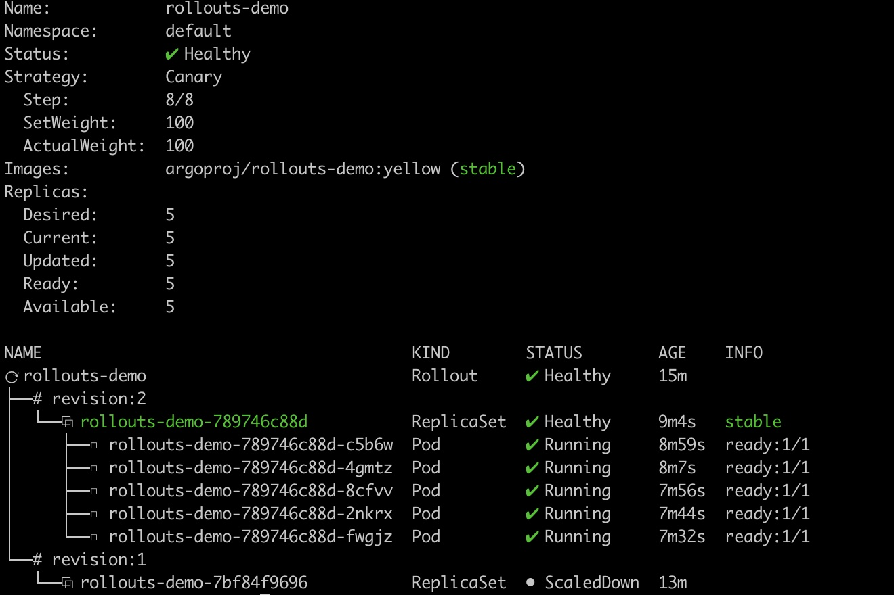
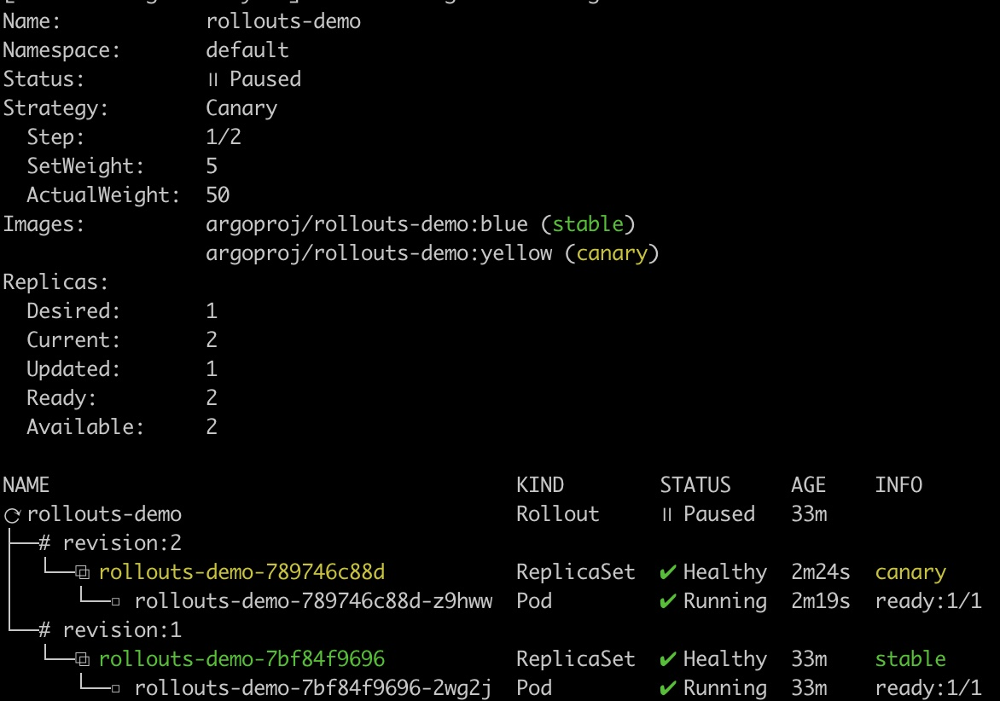

# 渐进式的Deployment--Argo Rollout
> 导语：熟悉k8s的同学知道Deployment目前只支持RollingUpgrade和ReCreate两种策略。而对于运维的同学而言，实际生产环境中更多应该使用灰度发布和蓝绿部署，笔者本想尝试造轮子，实现一个加强版，正好网上搜索到Argo-Rollout和我想法一致，就不用重复造轮子了，本文就是体验一下Argo-Rollout。

## 简介

[Argo-Rollout](https://argoproj.github.io/argo-rollouts/)是一个Kubernetes Controller和对应一系列的CRD，提供更强大的Deployment能力。包括灰度发布、蓝绿部署、更新测试(experimentation)、渐进式交付(progressive delivery)等特性。

**支持特性：**

* 蓝绿部署
* 灰度发布
* 细粒的，带权重的流量调度（traffic shifting）
* 自动rollback和promotion
* 手动管理
* 可定制的metric查询和kpi分析
* Ingress controller集成：nginx，alb
* Service Mesh集成：Istio，Linkerd，SMI
* Metric provider集成：Prometheus, Wavefront, Kayenta, Web, Kubernetes Jobs

**原理：**

Argo原理和Deployment差不多，只是加强rollout的策略和流量控制。当spec.template发送变化时，Argo-Rollout就会根据spec.strategy进行rollout，通常会产生一个新的ReplicaSet，逐步scale down之前的ReplicaSet的pod数量。

## 安装

[官方安装文档](https://argoproj.github.io/argo-rollouts/installation/#kubectl-plugin-installation)

1.安装argo-rollouts的controller和crd

```bash
kubectl create namespace argo-rollouts
kubectl apply -n argo-rollouts -f https://raw.githubusercontent.com/argoproj/argo-rollouts/stable/manifests/install.yaml
```

2.安装argo-rollouts的kubectl plugin

```bash
curl -LO https://github.com/argoproj/argo-rollouts/releases/latest/download/kubectl-argo-rollouts-linux-amd64
chmod +x ./kubectl-argo-rollouts-linux-amd64
mv ./kubectl-argo-rollouts-linux-amd64 /usr/local/bin/kubectl-argo-rollouts
```

## 使用

灰度发布包含Replica Shifting和Traffic Shifting两个过程。

### Replica Shifting

这里就直接拿官网的[例子](https://argoproj.github.io/argo-rollouts/getting-started/)，来体验一下Replica Shifting。

#### 1.部署一个Demo应用

首先创建一个Rollout的CR和访问该CR的Service:

```bash
kubectl apply -f https://raw.githubusercontent.com/argoproj/argo-rollouts/master/docs/getting-started/basic/rollout.yaml
kubectl apply -f https://raw.githubusercontent.com/argoproj/argo-rollouts/master/docs/getting-started/basic/service.yaml
```

Rollout CR，可以看到除了`apiVersion`，`kind`以及`strategy`之外，其他和Deployment无异，实际上其源码基本上都是引用的Deployment的数据结构:

```yaml
#cat rollout.yaml
apiVersion: argoproj.io/v1alpha1
kind: Rollout
metadata:
  name: rollouts-demo
spec:
  replicas: 5
  strategy:
    canary:
      steps:
      - setWeight: 20
      - pause: {}
      - setWeight: 40
      - pause: {duration: 10}
      - setWeight: 60
      - pause: {duration: 10}
      - setWeight: 80
      - pause: {duration: 10}
  revisionHistoryLimit: 2
  selector:
    matchLabels:
      app: rollouts-demo
  template:
    metadata:
      labels:
        app: rollouts-demo
    spec:
      containers:
      - name: rollouts-demo
        image: argoproj/rollouts-demo:blue
        ports:
        - name: http
          containerPort: 8080
          protocol: TCP
        resources:
          requests:
            memory: 32Mi
            cpu: 5m
```

暴露的service：

```yaml
apiVersion: v1
kind: Service
metadata:
  name: rollouts-demo
spec:
  ports:
  - port: 80
    targetPort: http
    protocol: TCP
    name: http
  selector:
    app: rollouts-demo
```

可以使用Argo-Rollout提供的plugin查看其状态，感觉还是很香：

```bash
[root@xiowang-dev ~/yaml]# kubectl argo rollouts get rollout rollouts-demo
```




#### 2.更新spec触发rollout

然后通过修改spec中的镜像，触发一次rollout:

```bash
kubectl argo rollouts set image rollouts-demo rollouts-demo=argoproj/rollouts-demo:yellow
```

预期Rollout会创建一个新的ReplicaSet，并且逐步扩容新的ReplicaSet和缩容旧的ReplicaSet，用plugin查看一下:

```bash
# kubectl argo rollouts get rollout rollouts-demo --watch
```



可以看到Rollout新创建了ReplicaSet **rollouts-demo-789746c88d**，并且将老ReplicaSet的Pod转移到新的ReplicaSet，新老ReplicaSet的pod比例为: 1:4，并且状态为**Paused**，没有继续升级新pod，为什么呢？

主要原因就在这个spec.strategy，通过这个strategy我们可以看到其为升级设定了steps，由于是个列表，因此其会按照顺序执行。这里第一步就是**setWeight：20**，意味着需要将20%的pod更新为新版本；第二步动作为**pause: {}**，意味着将永久暂停，需要人为通过plugin使其继续:

```yaml
  strategy:
    canary:
      steps:
      - setWeight: 20
      - pause: {}
      - setWeight: 40
      - pause: {duration: 10} #停顿10s
      - setWeight: 60
      - pause: {duration: 10}
      - setWeight: 80
      - pause: {duration: 10}
```

我们通过promote命令使其进行下一步：

```bash
# kubectl argo rollouts promote rollouts-demo
```

让我们再查看结果，所有pod都为新的ReplicaSet的pod：




### Traffic Shifting

上面例子演示了Argo-Rollout如何控制Replica Shifting，而正常的灰度过程，应该包含Replica Shifting和Traffic Shifting两部分。

目前Argo-Rollout主要集成了**Ingress**和**ServiceMesh**两种流量控制方法，我的测试环境中目前只部署了Nginx-Controller那就使用Ingress做演示。

#### 1.部署物料

首先删除之前的例子:

```bash
kubectl delete -f https://raw.githubusercontent.com/argoproj/argo-rollouts/master/docs/getting-started/basic/rollout.yaml
kubectl delete -f https://raw.githubusercontent.com/argoproj/argo-rollouts/master/docs/getting-started/basic/service.yaml
```

再部署官网的例子:

```bash
kubectl apply -f https://raw.githubusercontent.com/argoproj/argo-rollouts/master/docs/getting-started/nginx/rollout.yaml
kubectl apply -f https://raw.githubusercontent.com/argoproj/argo-rollouts/master/docs/getting-started/nginx/services.yaml
kubectl apply -f https://raw.githubusercontent.com/argoproj/argo-rollouts/master/docs/getting-started/nginx/ingress.yaml
```

上面的文件会部署1个rollout，两个service和一个ingress:

Rollout里分别用`canaryService`和`stableService`分别定义了该应用灰度的Service Name(rollouts-demo-canary)和当前版本的Service Name(rollouts-demo-stable):

```yaml
apiVersion: argoproj.io/v1alpha1
kind: Rollout
metadata:
  name: rollouts-demo
spec:
  replicas: 1
  strategy:
    canary:
      canaryService: rollouts-demo-canary
      stableService: rollouts-demo-stable
      trafficRouting:
        nginx:
          stableIngress: rollouts-demo-stable
      steps:
      - setWeight: 5
      - pause: {}
...
```

Service rollouts-demo-canary 和 rollouts-demo-stable，二者内容一样。selector中暂时没有填上pod-template-hash，Argo-Rollout Controller会根据实际的ReplicaSet hash来修改该值:

```yaml
apiVersion: v1
kind: Service
metadata:
  name: rollouts-demo-canary
spec:
  ports:
  - port: 80
    targetPort: http
    protocol: TCP
    name: http
  selector:
    app: rollouts-demo
    # This selector will be updated with the pod-template-hash of the canary ReplicaSet. e.g.:
    # rollouts-pod-template-hash: 7bf84f9696

---
apiVersion: v1
kind: Service
metadata:
  name: rollouts-demo-stable
spec:
  ports:
  - port: 80
    targetPort: http
    protocol: TCP
    name: http
  selector:
    app: rollouts-demo
    # This selector will be updated with the pod-template-hash of the stable ReplicaSet. e.g.:
    # rollouts-pod-template-hash: 789746c88d
```

`Ingress`则定义了规则，nginx将rollouts-demo.local域名的请求转发到当前版本的`Service`(rollouts-demo-stable):

```yaml
apiVersion: networking.k8s.io/v1beta1
kind: Ingress
metadata:
  name: rollouts-demo-stable
  annotations:
    kubernetes.io/ingress.class: nginx
spec:
  rules:
  - host: rollouts-demo.local
    http:
      paths:
      - path: /
        backend:
          # Reference to a Service name, also specified in the Rollout spec.strategy.canary.stableService field
          serviceName: rollouts-demo-stable
          servicePort: 80
```

Rollout Controller会根据`ingress` rollouts-demo-stable内容，自动创建一个`ingress`用了灰度的流量，名字为<ROLLOUT-NAME>-<INGRESS-NAME>-canary，所以这里多了一个`ingress` rollouts-demo-rollouts-demo-stable-canary，将流量导向Canary `Service`(rollouts-demo-canary):

```yaml
apiVersion: extensions/v1beta1
kind: Ingress
metadata:
  generation: 1
  name: rollouts-demo-rollouts-demo-stable-canary
  namespace: default
  ownerReferences:
  - apiVersion: argoproj.io/v1alpha1
    blockOwnerDeletion: true
    controller: true
    kind: Rollout
    name: rollouts-demo
    uid: 2d5b728b-2f71-4bf2-8283-323acf8ef573
spec:
  rules:
  - host: rollouts-demo.local
    http:
      paths:
      - backend:
          serviceName: rollouts-demo-canary
          servicePort: 80
        path: / 
```

#### 2.触发更新

```bash
kubectl argo rollouts set image rollouts-demo rollouts-demo=argoproj/rollouts-demo:yellow
kubectl argo rollouts get rollout rollouts-demo
```

可以看到Rollout状态中**SetWeight**为5了



同时查看`Ingress`，多了`nginx.ingress.kubernetes.io/canary`和`nginx.ingress.kubernetes.io/canary-weight` 两条annotation:

```bash
#当前版本Ingress

#灰度Ingress
apiVersion: extensions/v1beta1
kind: Ingress
metadata:
  annotations:
    kubernetes.io/ingress.class: nginx
    nginx.ingress.kubernetes.io/canary: "true"
    nginx.ingress.kubernetes.io/canary-weight: "5"
  creationTimestamp: "2020-07-05T06:31:54Z"
  generation: 1
  name: rollouts-demo-rollouts-demo-stable-canary
```

细心的你也能看出上面结果显示有一个小问题问题**ActualWeight：50**，这里应该为5或者95，所以顺便提了个[issue](https://github.com/argoproj/argo-rollouts/issues/568)给社区。

## 总结

Argo-Rollout提供更加强大的Deployment，包含比较适合运维的灰度发布和蓝绿发布功能。本文也是简单体验了一下其灰度发布功能。

本文未提及的功能包括：

1. [Experiments](https://argoproj.github.io/argo-rollouts/features/experiment/)，可以加入到Steps中，用于检验每个Step是否符合用户预期；
2. [Analysis](https://argoproj.github.io/argo-rollouts/features/analysis/)，用于统计Rollout中的各种metrics，包括每个Step花费时间等。

另外想到一个需求Argo-Rollout暂时未支持:

> 对于traffic-shifting，在做灰度的时候应该是让固定的一些用户或者url流量到新版本，目前Argo-Rollout并不支持。

当然上面这个问题可以通过添加一个Experiment，由该Experiment去修改Ingress或者SMI中的内容来实现。

除去功能之外，从源码学习的角度来说，Argo-Rollout仍然是一个好项目，结构清晰，适合学习写Controller和Plugin。

> 思考：为什么不算复杂的代码，k8s自己不实现呢？猜测官方为了鼓励大家多写CRD吧，哈哈！