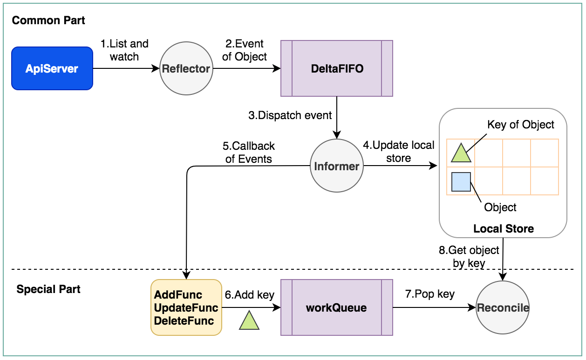

> **导读**：上一篇blog主要是简单介绍了一下kubebuilder的使用，这里再分析一下kubebuilder的代码逻辑。

## 1.kubebuilder的基础：controller
首先介绍一下k8s的一个controller的逻辑，下图主要参考client-go给的一个[workQueue的例子](https://github.com/kubernetes/client-go/blob/master/examples/workqueue/main.go)：

这里我把代码分为通用的**Common part**和**Special Part**。前者是[client-go](https://github.com/kubernetes/client-go)的基本流程，而后者部分是controller自身逻辑部分。具体过程包含8个步骤：

1.Reflector通过`ListAndWatch`方法去监听指定的Object；

```go
func (r *Reflector) Run(stopCh <-chan struct{}) {
	klog.V(3).Infof("Starting reflector %v (%s) from %s", r.expectedTypeName, r.resyncPeriod, r.name)
	wait.Until(func() {
		if err := r.ListAndWatch(stopCh); err != nil {
			utilruntime.HandleError(err)
		}
	}, r.period, stopCh)
}
```
2.Reflector会将所监听到的event，包括对object的`Add`，`Update`，`Delete`的操作push到**DeltaFIFO**这个queue中；

3.Informer首先会解析event中的action和object；

4.Informer将解析的object更新到local store，也就是本地cache中的数据更新；

5.然后Informer会执行Controller在初始化Infromer时注册的**ResourceEventHandler**(这些callback是可以自己修改的)；

6.ResourceEventHandler中注册的callback会将对应变化的object的key存入其初始化的一个workQueue；
7.最终controller会循环进行reconcile，就是从workQueue不停地pop key，然后去local store中取到对应的object，然后进行处理，最终多数情况会再通过client去更新这个object。

> 上面这个具体过程，我看网上大佬们也都分析过很多次了，但是根据我的经验呢，还是需要去看一遍代码心里才有底。以后出问题或者二次开发的时候，都是需要知道重要的结构体和API的。

## 2.kubebuilder的封装
想说明一下kubebuilder实际上是提供了对client-go进行封装的library，更加便利我们来开发k8s的operator。

我上面提到的[workQueue的例子](https://github.com/kubernetes/client-go/blob/master/examples/workqueue/main.go)已经实现了一个controller的逻辑。而kubebuilder还帮我们做了以下的额外工作：

1. kubebuilder引入了manager这个概念，一个manager可以管理多个controller，而这些controller会共享manager的client；
2. 如果manager挂掉或者停止了，所有的controller也会随之停止；
2. kubebuilder使用一个`map[GroupVersionKind]informer`来管理这些controller，所以每个controller还是拥有其独立的workQueue，deltaFIFO，并且kubebuilder也已经帮我们实现了这部分代码；
3. 我们主要需要做的开发，就是写`Reconcile`中的逻辑。

1.Manager通过`map[GroupVersionKind]informer`启动所有controller：

```go
func (ip *specificInformersMap) Start(stop <-chan struct{}) {
...
		for _, informer := range ip.informersByGVK {
			go informer.Informer.Run(stop)
		}
...
	<-stop
}
```
2.Controller处理event的逻辑都在[https://github.com/kubernetes-sigs/controller-runtime/blob/master/pkg/internal/controller/controller.go](https://github.com/kubernetes-sigs/controller-runtime/blob/master/pkg/internal/controller/controller.go)这个文件里面，其实它就是实现了workqueue这个例子的大部分代码，推荐先看懂这个例子再来分析这个文件。

#3.小结
写这篇blog本来想讲一下kubebuilder的代码流程的，但是发现要理解kubebuilder必须先理解client-go，基本上client-go代码熟悉之后再来分析kubebuilder就easy了...我自己太笨了，花了很多时间去啃client-go，假期余额紧张，所以关于kubebuilder自身的分析就没写太多了，有时间再补充吧。网上有一篇关于[kubebuilder的分析](https://juejin.im/post/5d8acac2e51d4577f54a0fd2)，有兴趣的同学可以参考一下吧，但是我觉得做二次开发一定要看自己亲自看和分析一遍。