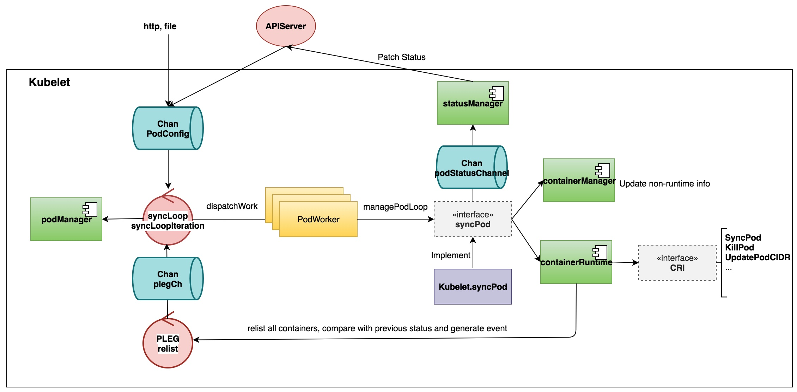

> 导读：目前完全专注于云原生的paas平台建设上，为了进一步了解k8s并且方便debug，因此对kubelet的源码进行初步分析和学习。其实网上分析kubelet的文章已经蛮多了，但是不过一遍代码，会给人仅仅背书的印象。这里主要简单梳理kubelet的启动过程和syncLoop过程，kubelet的各个组件可以后面单独分析和整理。

## 启动过程
kubelet的启动入口函数和其他组件一样，放在`cmd/kubelet/kubelet.go`下：

```go
func main() {
	rand.Seed(time.Now().UnixNano())

	command := app.NewKubeletCommand()
	logs.InitLogs()
	defer logs.FlushLogs()

	if err := command.Execute(); err != nil {
		os.Exit(1)
	}
}
```
通过调用`NewKubeletCommand`来创建cobra的一个command对象，在该对象`Run`方法中主要做了三件事：通过传入command的参数和配置文件传入kubelet所需的配置信息，初始化kubeletDeps(指明kubelet所依赖的组件)，然后调用`Run`创建并启动kubelet：

```go
// NewKubeletCommand creates a *cobra.Command object with default parameters
func NewKubeletCommand() *cobra.Command {
...
		Run: func(cmd *cobra.Command, args []string) {
...
			// construct a KubeletServer from kubeletFlags and kubeletConfig
			kubeletServer := &options.KubeletServer{
				KubeletFlags:         *kubeletFlags,
				KubeletConfiguration: *kubeletConfig,
			}
...
			// use kubeletServer to construct the default KubeletDeps
			kubeletDeps, err := UnsecuredDependencies(kubeletServer, utilfeature.DefaultFeatureGate)
			if err != nil {
				klog.Fatal(err)
			}
...
			// run the kubelet
			klog.V(5).Infof("KubeletConfiguration: %#v", kubeletServer.KubeletConfiguration)
			if err := Run(kubeletServer, kubeletDeps, utilfeature.DefaultFeatureGate, stopCh); err != nil {
				klog.Fatal(err)
			}
		},
	}
}

```

`Run`中仅仅调用了`run`，所以直接查看`run`函数，`run`主要干了以下几件事:

1. 初始化一下基本配置，包括kubeclient，eventclient，heartbeatclient，ContainerManager...；
2. 通过`PreInitRuntimeService`初始化CRI，创建容器和执行kubectl exec的流式Server都是在这里初始化；
3. 通过`RunKubelet`初始化kubelet所有依赖的组件，获取docker的配置文件路径，并且运行kubelet;

```go
func run(s *options.KubeletServer, kubeDeps *kubelet.Dependencies, featureGate featuregate.FeatureGate, stopCh <-chan struct{}) (err error) {
...
	err = kubelet.PreInitRuntimeService(&s.KubeletConfiguration,
		kubeDeps, &s.ContainerRuntimeOptions,
		s.ContainerRuntime,
		s.RuntimeCgroups,
		s.RemoteRuntimeEndpoint,
		s.RemoteImageEndpoint,
		s.NonMasqueradeCIDR)
...
	if err := RunKubelet(s, kubeDeps, s.RunOnce); err != nil {
		return err
	}
...			
}

```
接下来重点说一下`RunKubelet`，它一个是会通过`createAndInitKubelet`来实例化一个kubelet(包含各种manager和module的注册)，再通过`startKubelet`通过`Kubelet.Run`启动kubelet以及其注册的所有manager和module:

```go
func RunKubelet(kubeServer *options.KubeletServer, kubeDeps *kubelet.Dependencies, runOnce bool) error {
...
	k, err := createAndInitKubelet(&kubeServer.KubeletConfiguration,
		kubeDeps,
		&kubeServer.ContainerRuntimeOptions,
		kubeServer.ContainerRuntime,
		kubeServer.HostnameOverride,
		kubeServer.NodeIP,
		kubeServer.ProviderID,
		kubeServer.CloudProvider,
		kubeServer.CertDirectory,
		kubeServer.RootDirectory,
		kubeServer.RegisterNode,
		kubeServer.RegisterWithTaints,
		kubeServer.AllowedUnsafeSysctls,
		kubeServer.ExperimentalMounterPath,
		kubeServer.ExperimentalKernelMemcgNotification,
		kubeServer.ExperimentalCheckNodeCapabilitiesBeforeMount,
		kubeServer.ExperimentalNodeAllocatableIgnoreEvictionThreshold,
		kubeServer.MinimumGCAge,
		kubeServer.MaxPerPodContainerCount,
		kubeServer.MaxContainerCount,
		kubeServer.MasterServiceNamespace,
		kubeServer.RegisterSchedulable,
		kubeServer.KeepTerminatedPodVolumes,
		kubeServer.NodeLabels,
		kubeServer.SeccompProfileRoot,
		kubeServer.BootstrapCheckpointPath,
		kubeServer.NodeStatusMaxImages)
...
		startKubelet(k, podCfg, &kubeServer.KubeletConfiguration, kubeDeps, kubeServer.EnableCAdvisorJSONEndpoints, kubeServer.EnableServer)
...
}

func startKubelet(k kubelet.Bootstrap, podCfg *config.PodConfig, kubeCfg *kubeletconfiginternal.KubeletConfiguration, kubeDeps *kubelet.Dependencies, enableCAdvisorJSONEndpoints, enableServer bool) {
	// start the kubelet
	go wait.Until(func() {
		k.Run(podCfg.Updates())
	}, 0, wait.NeverStop)

	// start the kubelet server
	if enableServer {
		go k.ListenAndServe(net.ParseIP(kubeCfg.Address), uint(kubeCfg.Port), kubeDeps.TLSOptions, kubeDeps.Auth, enableCAdvisorJSONEndpoints, kubeCfg.EnableDebuggingHandlers, kubeCfg.EnableContentionProfiling)

	}
	if kubeCfg.ReadOnlyPort > 0 {
		go k.ListenAndServeReadOnly(net.ParseIP(kubeCfg.Address), uint(kubeCfg.ReadOnlyPort), enableCAdvisorJSONEndpoints)
	}
	if utilfeature.DefaultFeatureGate.Enabled(features.KubeletPodResources) {
		go k.ListenAndServePodResources()
	}
}

// Run starts the kubelet reacting to config updates
func (kl *Kubelet) Run(updates <-chan kubetypes.PodUpdate) {
	if kl.logServer == nil {
		kl.logServer = http.StripPrefix("/logs/", http.FileServer(http.Dir("/var/log/")))
	}
	if kl.kubeClient == nil {
		klog.Warning("No api server defined - no node status update will be sent.")
	}

	// Start the cloud provider sync manager
	if kl.cloudResourceSyncManager != nil {
		go kl.cloudResourceSyncManager.Run(wait.NeverStop)
	}

	if err := kl.initializeModules(); err != nil {
		kl.recorder.Eventf(kl.nodeRef, v1.EventTypeWarning, events.KubeletSetupFailed, err.Error())
		klog.Fatal(err)
	}

	// Start volume manager
	go kl.volumeManager.Run(kl.sourcesReady, wait.NeverStop)

	if kl.kubeClient != nil {
		// Start syncing node status immediately, this may set up things the runtime needs to run.
		go wait.Until(kl.syncNodeStatus, kl.nodeStatusUpdateFrequency, wait.NeverStop)
		go kl.fastStatusUpdateOnce()

		// start syncing lease
		go kl.nodeLeaseController.Run(wait.NeverStop)
	}
	go wait.Until(kl.updateRuntimeUp, 5*time.Second, wait.NeverStop)

	// Set up iptables util rules
	if kl.makeIPTablesUtilChains {
		kl.initNetworkUtil()
	}

	// Start a goroutine responsible for killing pods (that are not properly
	// handled by pod workers).
	go wait.Until(kl.podKiller, 1*time.Second, wait.NeverStop)

	// Start component sync loops.
	kl.statusManager.Start()
	kl.probeManager.Start()

	// Start syncing RuntimeClasses if enabled.
	if kl.runtimeClassManager != nil {
		kl.runtimeClassManager.Start(wait.NeverStop)
	}

	// Start the pod lifecycle event generator.
	kl.pleg.Start()
	kl.syncLoop(updates, kl)
}
```
## syncLoop过程
从Kubelet启动的`Kubelet.Run`最后一行代码，`kl.syncLoop(updates, kl)
`，跳进去我们就可以看到kubelet最核心的syncLoop过程，也就是更新pod消息处理过程。这里就直接画图来解释了。

1. 用户从http，静态文件以及APIServer对pod的修改通过`PodConfig`channel传递到`syncLoop`；
2. `syncLoop`的`syncLoopIteration`从`PodConfig`中取出update的内容，一方面会通过`podManger`里更新pod状态，另一方面会通过`dispatchWork`将更新内容通过`PodWoker`更新pod状态，调用的是`syncPod`这个接口(由`Kubelet.syncPod`实现)；
3. 而`syncPod`这里通过`podStatusChannel`channel更新状态到`statusManager`, 再patch Status到APIServer；
4. `syncPod`一方面通过`containerManager`更新non-runtime的信息，例如QoS，Cgroup信息；另外一方面通过CRI更新pod的状态(对于更加详细的pod操作过程主要通过研究Dockershim，或者其他shim就可以搞清楚了)；
5. 另外一方面，`PLEG`会周期(默认1s)通过`relist`从CRI获取所有pod当前状态并且跟之前状态对比产生Pod的event发送到`syncLoop`;



# 小结
本文对kubelet的启动过程进行了学习和总结，并且简单介绍了一下syncLoop的处理流程。大概清楚了kubelet的代码结构，后面可以针对CRI，CSI以及Device Plugin等内容进行研究。